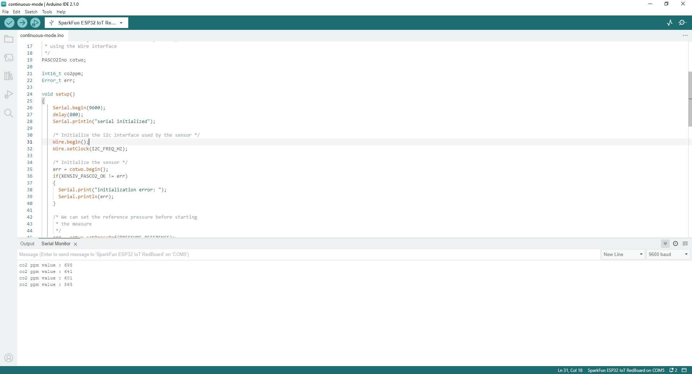
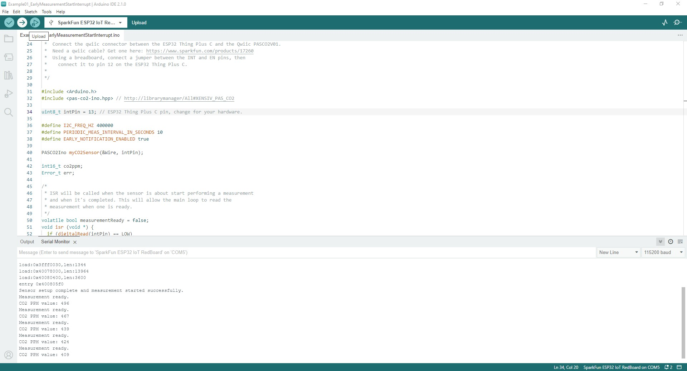

## Example 1 - Continuous Mode

The first example demonstrates how to initialize the sensor over I<sup>2</sup>C to measure CO<sub>2</sub> data in Continuous Mode and print it out over serial. Open the example by navigating to <b>File</b> > <b>Examples</b> > <b>XENSIV PAS CO2</b> > <b> <b>continuous-mode</b>. After opening the example, select your Board and Port (in our case, SparkFun RedBoard IoT), and click "Upload". Open the [serial terminal](https://learn.sparkfun.com/tutorials/terminal-basics/arduino-serial-monitor-windows-mac-linux) with the baud set to <b>9600</b> and you should see the same as the screenshot below:

<figure markdown>
[{  width="400"}](./assets/images/Early_Measurement-Serial_Print.jpg "Click to enlarge")
</figure>

## Example 2 - Boost Regulator Early Notification

The second example follows the assembly step in the Hardware Assembly section tying the PAS CO2's INT pin to the boost regulator's EN pin to control power for the regulator during measurements. This is a custom example we wrote so you'll need to get it from the [GitHub Repository](https://github.com/sparkfun/SparkFun_Qwiic_CO2_Sensor_XENSIV_PAS) or by copying the code below into a blank sketch:

???
    ```
    <!-- --8<-- "https://raw.githubusercontent.com/sparkfun/SparkFun_Qwiic_CO2_Sensor_XENSIV_PAS/main/Firmware/Examples/Example01_EarlyMeasurementStartInterrupt/Example01_EarlyMeasurementStartInterrupt.ino" -->
    ```

Select your board and port and upload the example. After the uploade completes, open the serial terminal with the baud set to <b>115200</b> and you should see a printout similar to the one below with CO<sub>2</sub> measurements printing every ten seconds:

<figure markdown>
[{  width="400"}](./assets/images/Early_Measurement-Serial_Print.jpg "Click to enlarge")
</figure>