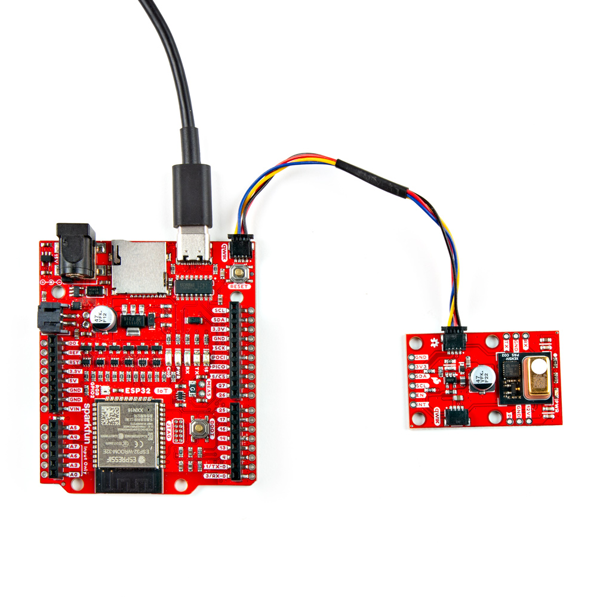
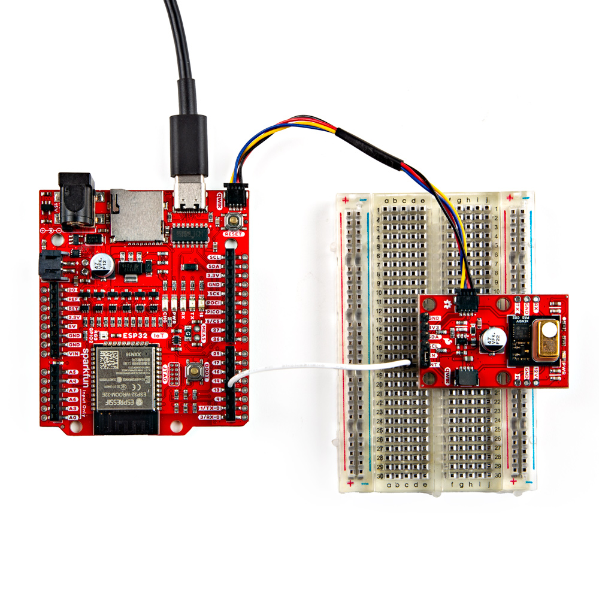

Now that we're familiar with the PAS CO2 sensor and other hardware on this breakout, it's time to assemble it into a circuit.

## Qwiic Assembly

SparkFun's Qwiic system makes assembling a circuit a breeze. Simply plug the breakout into your chosen microcontroller with a Qwiic cable. After assembling your circuit, it should look similar to the photo below:

<figure markdown>
[{  width="400"}](./assets/images/Qwiic_PAS_CO2_Sensor-Basic_Assembly.jpg "Click to enlarge")
</figure>

## Soldered Assembly

Those who prefer to use either the UART or PWM interfaces or the other pins broken out on this board should solder wires or header pins to the PTH pins on the side of the board. If you're not familiar with through-hole soldering or would like a refresher, take a look at our Through-Hole Soldering Tutorial:

-   <a href="https://learn.sparkfun.com/tutorials/5">
    <figure markdown>
    
    </figure>
    </a>
    <a href="https://learn.sparkfun.com/tutorials/5">**How to Solder: Through-Hole Soldering**
    </a>

### Boost Regulator Interrupt Assembly

The Early Measurement example in the Examples section demonstrates how to use the PAS CO2's Interrupt pin as an early measurement signal to control the boost regulator's power during measurement periods. If you want to follow along with that example you'll need to tie the INT PTH pin and EN PTH pin together. We recommend a set of [headers](https://www.sparkfun.com/products/12693) to these PTHs and bridge the EN and INT pins together using a jumper like [this](https://www.sparkfun.com/products/9044). You can also create a temporary connection between these pins with some alligator clips or through some wiring on a breadboard.

Next, connect the INT pin on the PAS CO2 sensor breakout to an [interrupt capable pin]() on your development board. The example assumes the use of an ESP32 development board and sets pin 13 so adjust the wiring and code if necessary. With everything wired up on a [breadboard](), the circuit should look something similar to the photo below:

<figure markdown>
[{  width="400"}](./assets/images/Qwiic_PAS_CO2_Sensor-Interrupt_Assembly.jpg "Click to enlarge")
</figure>

## Calibration Procedure

The PASCO2V01 sensors require a week long calibration period, measuring every 10 seconds. During that period, the sensor *must* be outside for at least 30 minutes while taking measurements. Refer to the [Automatic baseline offset correction (ABOC) and forced compensation scheme (FCS)](./assets/component_documentation/Infineon-AN_FCS_ABOC_XENSIV_PASCO2_2-ApplicationNotes-v01_04-EN.pdf) application note for complete information about the calibration process. The graph below shows three sensors data outputs merge together during our calibration testing:

<figure markdown>
[{  width="400"}](./assets/images/Calibration_Graph.png "Click to enlarge")
</figure>

## Installation Recommendations

For ideal measurements, Infineon has several recommendations for installing the sensor in the final application found in this [application note](./assets/component_documentation/Infineon-PAS_CO2_General_Design-In_Guideline.docx.-ApplicationNotes-v01_02-EN.pdf). The list below outlines most of them but for complete information, refer to the app note linked above.

* Allow space above the sensor at least 12mm tall with a minimum opening size of 14mm x 14mm.
* Avoid direct airflow in front of the sensor.
* Isolate the sensor from ambient heat sources.
* Isolate the sensor from vibration sources.
* Avoid placing the sensor in direct sunlight.
* Prevent any condensation/water contact with the sensor.