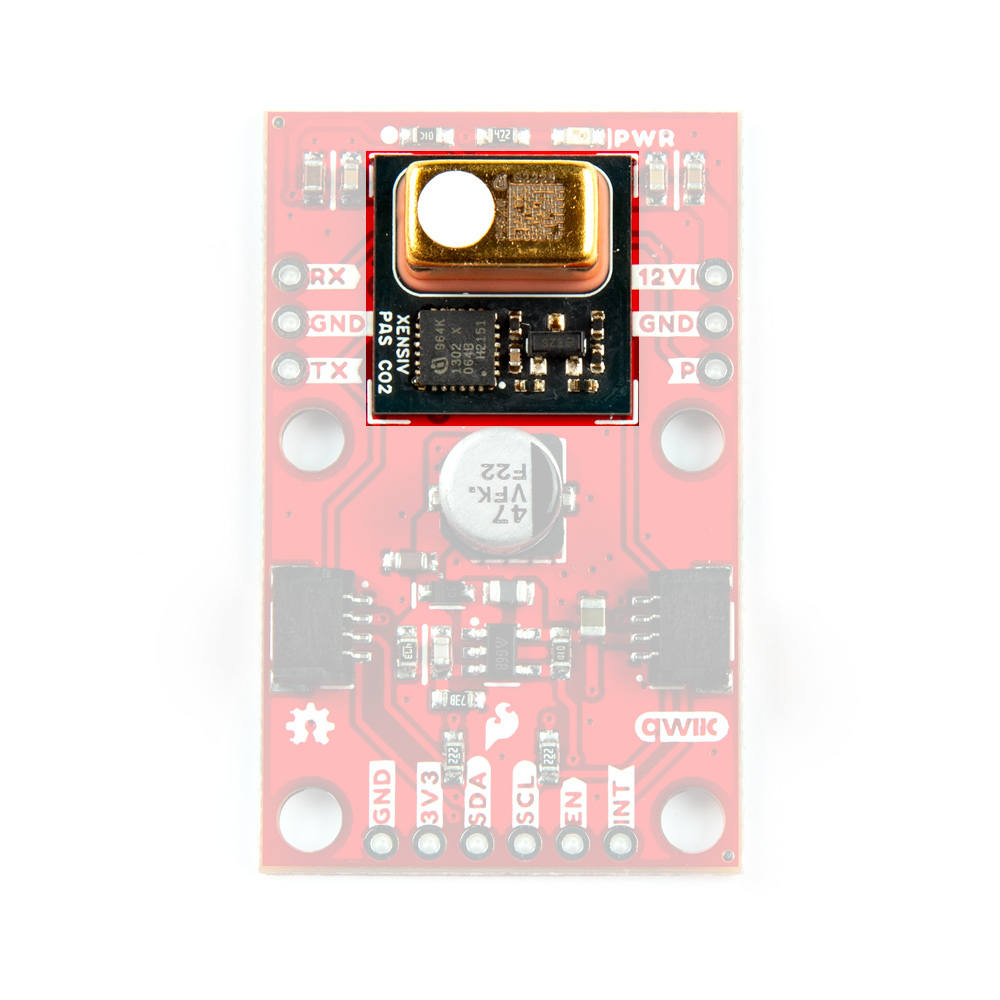
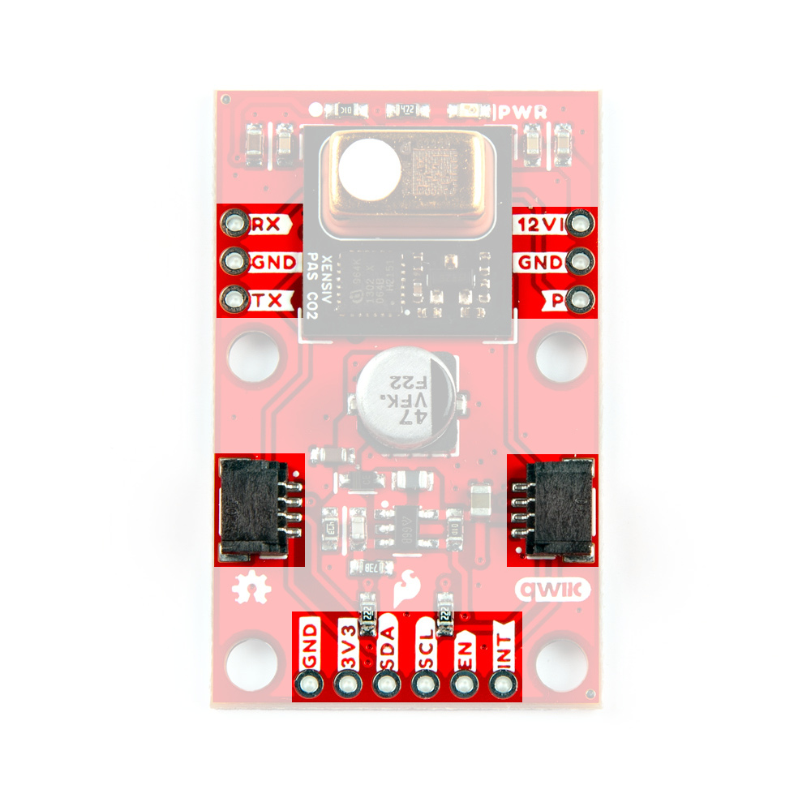
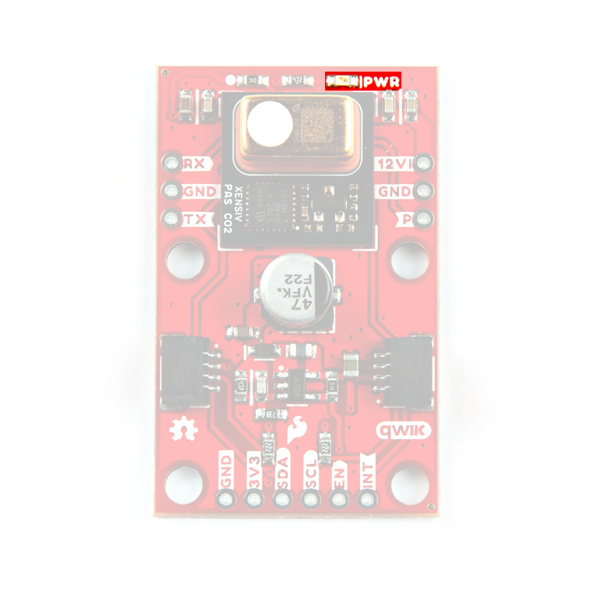
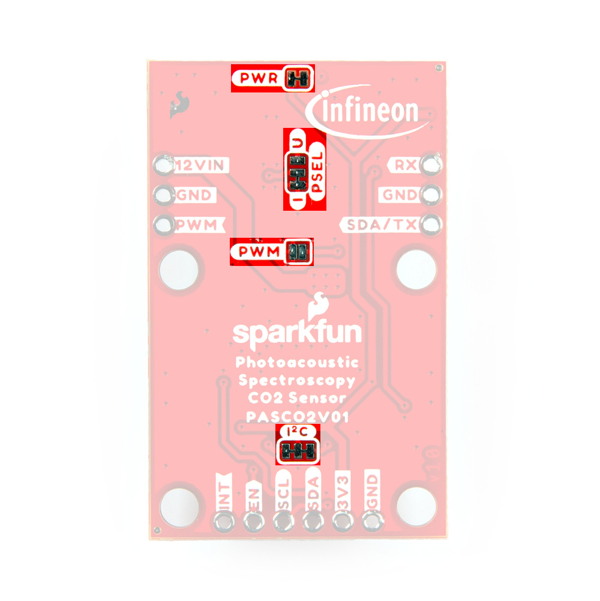
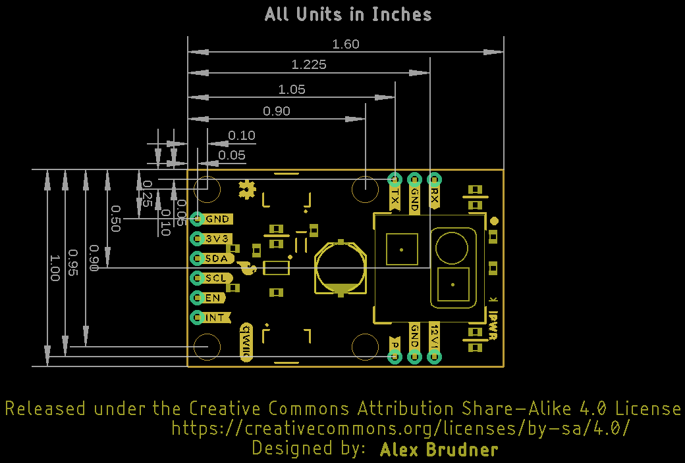

Let's take a closer look at the XENSIV™ PAS CO2 sensor and other hardware present on this Qwiic breakout.

## XENSIV PAS CO2 Sensor

The XENSIV PAS CO2 sensor from Infineon utilizes a photoacoustic spectroscopy gas measurement system to accurately measure CO2 concentration in a very stable sensing environment. 

<figure markdown>
[{  width="400"}](./assets/images/Qwiic_PAS_CO2_Sensor-PASCO2.jpg "Click to enlarge")
</figure>

Photoacoustic spectroscopy uses a combination of narrow-band filtered IR light and MEMS microphone to measure CO2 molecule concentration with high accuracy. The PAS CO2 package includes an on-board microcontroller that parses the data recorded and converts it into direct parts per million (ppm) output to either UART, I2C, or pulse width modulation (PWM). For a complete overview of the PAS CO2, refer to the [datasheet](./assets/component_documentation/Infineon-PASCO2V01-DataSheet-v01_03-DataSheet-v01_03-EN.pdf).

You may be wondering what photoacoustic spectroscopy means. Photoacoustic measuring uses light (photo) and sound/vibrations (acoustic) in tandem to measure the the photoacoustic effect when energy is absorbed by particles. The sensor shines a specific frequency of IR light that CO2 molecules absorb causing them to heat up, expand and release a pressure wave (sound) wave that the MEMS microphone picks up. This data is then processed and output in human-readable concentrations in PPM. This is just a quick and basic explanation of photoacoustic spectroscopy used in the PAS CO2 sensor. For detailed information, refer to Invensense's [product brief](https://www.infineon.com/cms/en/product/sensor/co2-sensors/#!?fileId=5546d4626b2d8e69016b69ba27c958c1) for the sensor.

The PAS CO2 has three operating modes: Idle, Continuous, and Single-Shot. In idle mode the sensor is inactive and does not take any measurements. In continuous mode the sensor takes periodic measurements and returns to idle once the measurement sequence finishes. The measurement period is configurable from anywhere between 5 to 4095 seconds. In single-shot mode the sensor enters a single measurement period and then returns to idle mode. 

<table>
    <tr>
        <th>Parameter</th>
        <th>Units</th>
        <th>Min</th>
        <th>Typ</th>
        <th>Max</th>
        <th>Notes</th>
    </tr>
    <tr>
        <td>CO2 Output Range</td>
        <td>ppm</td>
        <td>0</td>
        <td>-</td>
        <td>32,000</td>
        <td></td>
    </tr>
    <tr>
        <td>CO2 Measurement Accuracy</td>
        <td>ppm</td>
        <td>-</td>
        <td>&plusmn;(30 + 3%)</td>
        <td>-</td>
        <td>Accuracy when measuring between 400ppm and 5,000ppm.</td>
    </tr>
    <tr>
        <td>Ambient Temperature Range</td>
        <td>&deg;C</td>
        <td>0</td>
        <td>-</td>
        <td>50</td>
        <td></td>
    </tr>
    <tr>
        <td>Relative Humidity Range</td>
        <td>%RH</td>
        <td>0</td>
        <td>-</td>
        <td>85</td>
        </td></td>
    </tr>
    <tr>
        <td>CO2 Sampling Time</td>
        <td>s</td>
        <td>5</td>
        <td>60</td>
        <td>4095</td>
        <td></td>
    </tr>
</table>

## Power & Boost Circuit

The PAS CO2 uses two input voltages, <b>12V</b> for the IR emitter and <b>3.3V</b> for the microcontroller and other components. This breakout has a AP3012 boost regulator to step up <b>3.3V</b> from the Qwiic connectors to <b>12V</b> along with a series of decoupling capacitors to ensure the IR emitter gets a clean supply voltage. The breakout also has PTH pins for both supply voltage if users prefer to power the sensor from a dedicated power supply. If you select this option, ensure both voltages fall within the supply range for each input (VDD3.3: <b>3V</b>-<b>3.6V</b> and VDD12: <b>10.8V</b>-<b>13.2V</b>).

## Communication Interfaces & Pinout

We designed this board to set the PAS CO2 to communicate by I2C by default but have included PTH pins for both the UART and PWM interfaces along with solder jumpers to enable/disable all three options.

<figure markdown>
[{  width="400"}](./assets/images/Qwiic_PAS_CO2_Sensor-Pinout.jpg "Click to enlarge")
</figure>

### Qwiic/I2C

The board routes the PAS CO2's I2C interface to a pair of Qwiic connectors as well as 0.1"-spaced plated through-hole (PTH) headers. This header also includes the PAS CO2's Interrupt pin, the AP3012 boost regulator's Enable pin, as well as connections to <b>3.3V</b> and <b>GND</b>. The PAS CO2's unshifted 7-bit I2C address is <b>0x28</b>.

The Interrupt pin can function as a standard hardware interrupt for alarm thresholds, data ready, and sensor busy statuses but also is configurable to act as an early measurement start notification. In this mode, the interrupt pin enters an active state (set to either active-high or active-low) roughly one second before a measurement period which can be tied to the enable pin for the LM62421 boost regulator. The interrupt turns this power supply on for roughly 0.2s at the start of the measurement period and again at the end. The design of the board has both this pin and the boost regulator's enable pin next to each other so users can tie them to each other to turn on the boost regulator just before measurement occurs to help conserve power.

### UART

The board routes the TX and RX pins to one side of the board along with a Ground PTH for voltage reference if needed. This interface is disabled by default and requires adjusting the PSEL jumper on the back of the board. Read on to the Solder Jumpers section for more information about enabling UART. 

### PWM

The PAS CO2's PWM interface is routed to the oppposite side of the board from the UART and also includes a Ground PTH for voltage reference. This interface is also disabled by default and can be enabled by adjusting the PWM jumper on the back of the board. Read on to the Solder Jumpers section for more information on enabling PWM output.

## Power LED

The lone LED on this board labeled <b>PWR</b> indicates when the <b>3.3V</b> circuit is powered.

<figure markdown>
[{  width="400"}](./assets/images/Qwiic_PAS_CO2_Sensor-LED.jpg "Click to enlarge")
</figure>

## Solder Jumpers

The breakout has four solder jumpers labeled <b>PWR</b>, <b>PSEL</b>, <b>PWM</b>, and <b>I2C</b>.

<figure markdown>
[{  width="400"}](./assets/images/Qwiic_PAS_CO2_Sensor-Jumpers.jpg "Click to enlarge")
</figure>

* <b>PWR</b>: The PWR jumper completes the Power LED circuit. Open it to turn off the power LED to reduce the current draw of the board. 
* <b>PSEL</b>: The PSEL jumper is a three-way jumper that sets whether the PAS CO2 outputs over I2C (Default) or UART (Alternate). By default, the jumper pulls the PSEL line to Ground and enables the I2C interface indicated by the small "I" on the jumper. Severing the trace between the "I" pad and center pad and then connecting the center pad to the "U" pad switches the PAS CO2 to communicate over UART.
* <b>PWM</b>: The PWM jumper controls the PWM output through the PWM disable input pin. This jumper is OPEN by default to disable PWM through the internal pullup resistor. Close it to tie the PWM disable pin to ground and enable PWM output.

## Board Dimensions

This breakout measures in a bit larger than the Qwiic 1"x1" standard to accomidate the boost circuit for the IR emitter. The board measures 1"x1.6"(25.4mm x 40.64mm) with four mounting holes that fit a [4-40 screw](https://www.sparkfun.com/products/10453).

<figure markdown>
[{ width="400"}](./assets/board_files/SparkFun_Qwiic_CO2_Sensor_XENSIV_PAS-Dimensions.png "Click to enlarge")
</figure>